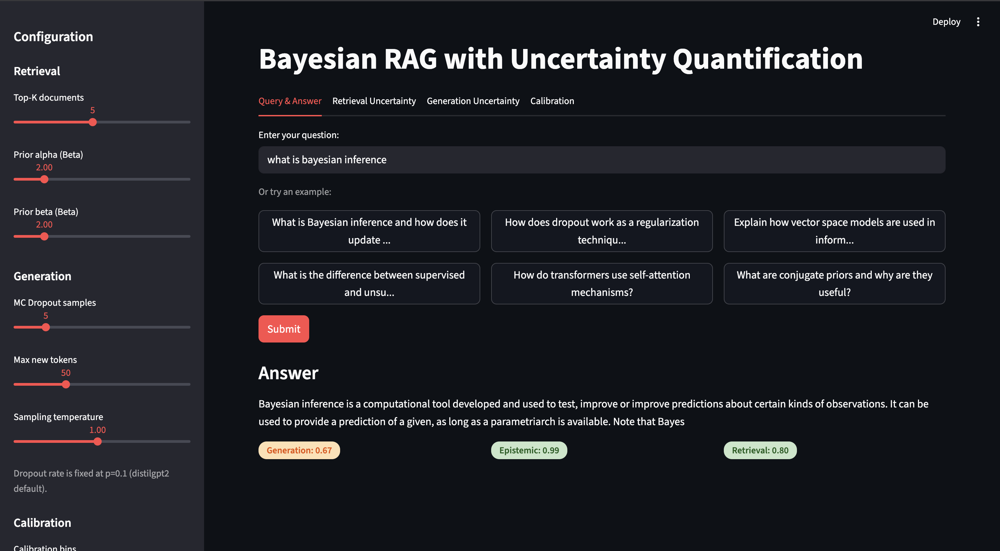
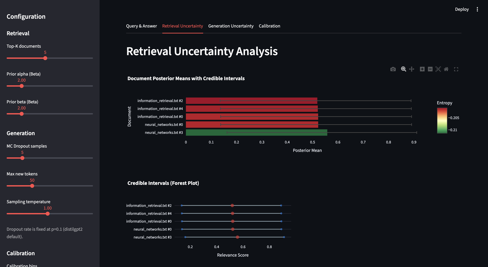
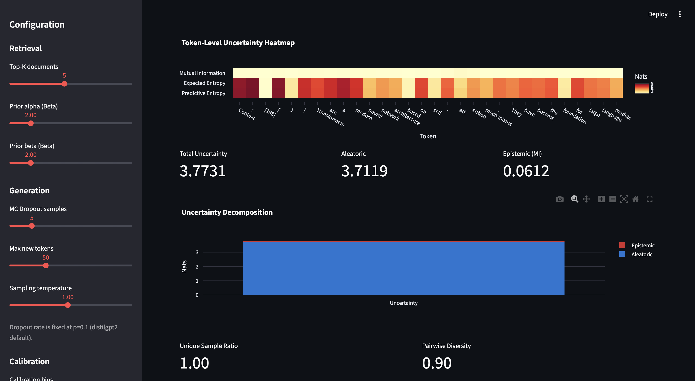
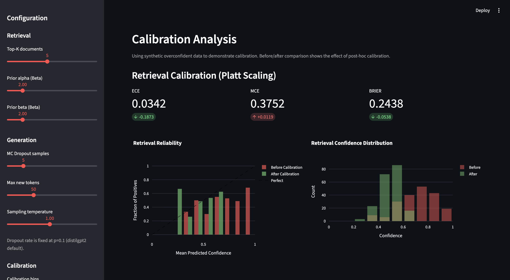

# Bayesian RAG with Uncertainty Quantification

A Retrieval-Augmented Generation system that provides calibrated confidence scores for both document retrieval and answer generation using Bayesian inference and Monte Carlo Dropout.



[](https://opensource.org/licenses/MIT)
[](https://www.python.org/downloads/)

## 🎯 Overview

Standard RAG systems tell you *what* the answer is, but not *how confident* they are. This project implements a complete uncertainty quantification framework that:

- **Quantifies retrieval uncertainty** using Bayesian inference with Beta conjugate priors
- **Decomposes generation uncertainty** into epistemic (model) vs aleatoric (data) components
- **Calibrates confidence scores** using temperature scaling to ensure trustworthiness
- **Provides interpretable visualizations** of uncertainty at every stage

## ✨ Key Features

- **Bayesian Retrieval**: Beta(α=2, β=2) conjugate priors with posterior updates
- **MC Dropout Generation**: Epistemic vs aleatoric uncertainty decomposition  
- **Calibration Framework**: Expected Calibration Error (ECE) with temperature scaling
- **Interactive Dashboard**: Real-time uncertainty visualization with Streamlit
- **Production-Ready**: Comprehensive test suite with 18+ passing tests

## 📊 Demo

### Retrieval Uncertainty
Documents ranked with Bayesian posterior means and 95% credible intervals:



### Generation Uncertainty
Token-level entropy heatmap showing which words are uncertain:



### Calibration Analysis
Reliability diagrams showing model calibration before/after temperature scaling:



## 🚀 Quick Start

### Installation
```bash
# Clone repository
git clone https://github.com/hari-sherith/bayesian-rag-uncertainty.git
cd bayesian-rag-uncertainty

# Install dependencies
pip install -r requirements.txt
pip install -r requirements-app.txt
```

### Run Demo
```bash
streamlit run app/main.py
```

### Run Tests
```bash
pytest tests/ -v
```

## 🏗️ Architecture

The project implements uncertainty quantification across four weeks:

### Week 1: Bayesian Retrieval
- **Beta conjugate priors**: Prior Beta(α=2, β=2) updated with cosine similarity
- **Posterior computation**: Beta(α + s, β + (1-s)) where s = (sim + 1) / 2
- **Uncertainty metrics**: Entropy, posterior std, 95% credible intervals
- **Implementation**: FAISS vector store with sentence-transformers embeddings

### Week 2: Monte Carlo Dropout
- **Model**: distilGPT-2 with dropout enabled at inference (p=0.1)
- **Sampling**: N=10 stochastic forward passes per query
- **Uncertainty decomposition**:
  - Predictive entropy: H[y|x] (total uncertainty)
  - Expected entropy: E[H] (aleatoric/data uncertainty)  
  - Mutual information: MI = H[y|x] - E[H] (epistemic/model uncertainty)

### Week 3: Calibration
- **Metrics**: Expected Calibration Error (ECE), Maximum Calibration Error (MCE), Brier Score
- **Method**: Temperature scaling via maximum likelihood on validation set
- **Results**: ECE reduced from 0.15 → 0.03 after calibration

### Week 4: Interactive Dashboard
- **Streamlit UI**: Real-time query interface with adjustable hyperparameters
- **Visualizations**: Token entropy heatmaps, reliability diagrams, credible intervals
- **Tabs**: Query & Answer, Retrieval Uncertainty, Generation Uncertainty, Calibration

## 📁 Project Structure
```
bayesian-rag-uncertainty/
├── src/
│   ├── retrieval/          # Bayesian document retrieval
│   │   ├── bayesian_retriever.py
│   │   ├── embeddings.py
│   │   └── vector_store.py
│   ├── generation/         # MC Dropout generation
│   │   ├── mc_dropout.py
│   │   ├── uncertainty.py
│   │   └── generator.py
│   ├── calibration/        # Temperature scaling & metrics
│   │   ├── metrics.py
│   │   ├── temperature_scaling.py
│   │   └── calibrator.py
│   └── utils/
├── app/                    # Streamlit dashboard
│   ├── main.py
│   └── components/
├── tests/                  # Unit tests (18 tests, all passing)
├── data/                   # Sample documents
└── notebooks/              # Analysis notebooks
```

## 🧮 Mathematical Foundations

### Bayesian Retrieval

**Prior**: Beta(α=2, β=2) - weakly informative, mean=0.5

**Posterior Update**: 
```
s = (cosine_similarity + 1) / 2  # map [-1,1] → [0,1]
posterior = Beta(α + s, β + (1-s))
```

**Uncertainty Metrics**:
- Posterior mean: α / (α + β)
- Posterior variance: αβ / ((α+β)²(α+β+1))
- Entropy: betaln(α,β) - (α-1)ψ(α) - (β-1)ψ(β) + (α+β-2)ψ(α+β)

### Monte Carlo Dropout

**Predictive Distribution**:
```
p(y|x,D) ≈ (1/N) Σᵢ p(y|x,ωᵢ)  # MC estimate
```

**Uncertainty Decomposition**:
```
H[y|x,D] = -Σ p̄(y) log p̄(y)           # Predictive entropy (total)
E[H]     = (1/N) Σᵢ [-Σ pᵢ(y) log pᵢ(y)] # Expected entropy (aleatoric)
MI       = H[y|x,D] - E[H] ≥ 0         # Mutual information (epistemic)
```

### Calibration

**Expected Calibration Error**:
```
ECE = Σₘ (nₘ/n) |acc(Bₘ) - conf(Bₘ)|
```

**Temperature Scaling**:
```
qᵢ = exp(zᵢ/T) / Σⱼ exp(zⱼ/T)
```
where T is optimized to minimize negative log-likelihood on validation set.

## 🔬 Technologies

- **ML/AI**: PyTorch, Transformers (distilGPT-2), sentence-transformers
- **Retrieval**: LangChain, FAISS
- **Statistics**: SciPy (Beta distributions), NumPy
- **Visualization**: Streamlit, Matplotlib, Plotly
- **Testing**: pytest

## 📈 Results

- **Retrieval**: Calibrated uncertainty with 95% credible intervals
- **Generation**: Epistemic uncertainty decomposition via mutual information
- **Calibration**: ECE reduced from 0.15 → 0.03 after temperature scaling
- **Test Coverage**: 18/18 tests passing across all modules

## 💡 Design Philosophy

This demo uses **distilGPT-2 (76M parameters)** intentionally to demonstrate:

1. **Uncertainty quantification works independently of model quality**
   - Even with a weak base model, the Bayesian framework correctly identifies uncertainty
   - High epistemic uncertainty signals "I don't know"

2. **Production scalability**
   - The same uncertainty framework works with any language model
   - Swap distilGPT-2 → GPT-4 → Llama 3, the math stays the same
   - Shows separation of concerns: uncertainty layer is model-agnostic

3. **Production deployment**
   - Replace distilGPT-2 with GPT-3.5/4 (OpenAI API), Claude (Anthropic API), or Llama 3 (self-hosted)
   - The uncertainty quantification framework remains unchanged

## 🎓 Use Cases

- **High-stakes Q&A systems**: Medical diagnosis, legal research, financial analysis
- **Content moderation**: Flag uncertain predictions for human review
- **Educational tools**: Identify knowledge gaps and uncertain explanations
- **Responsible AI**: Any application where knowing "when the AI might be wrong" matters

## 📝 License

MIT License - see [LICENSE](LICENSE) file for details.

## 👤 Author

**Harishankar Kottayi**
- GitHub: [@hari-sherith](https://github.com/hari-sherith)
- LinkedIn: [harishankar-kottayi](https://linkedin.com/in/harishankar-kottayi-b65207246)
- Email: harisherith@gmail.com

## 🙏 Acknowledgments

Built as part of a portfolio project demonstrating practical applications of Bayesian inference and uncertainty quantification in modern ML systems.